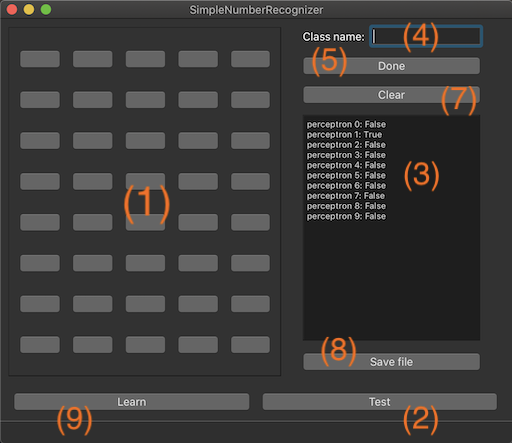
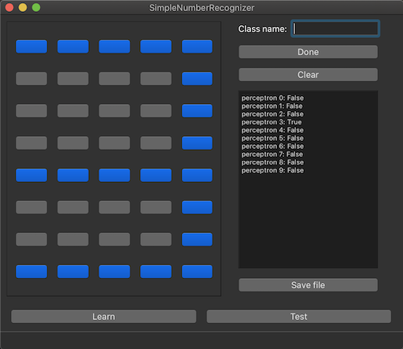
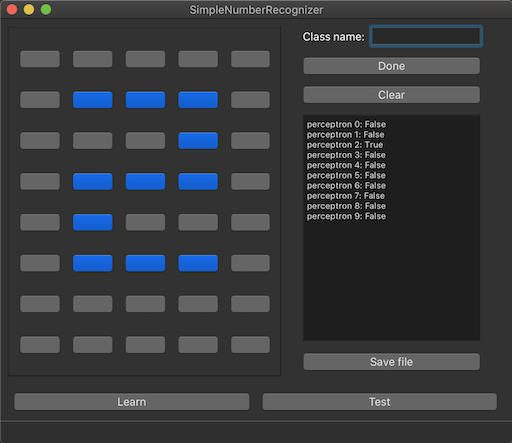
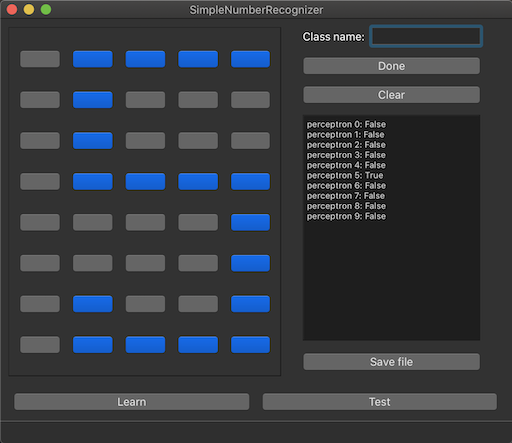

# SimpleNumberRecognizer

### Perceptron based simple number recognizer written using pure Python 3.
[](https://www.codefactor.io/repository/github/masich/simple-number-recognizer)
[](LICENSE)

This project is created just for fun and practice.

The goal of the project is very primitive: the user "draws" some numbers (0-9) using buttons, and the program tries to 
guess the drawn number. You can teach an internal perceptron based neural network by yourself or use simple predefined 
learning dataset located in a ```data``` folder. 

## Instruction


## For teaching
* Use buttons **(1)** to draw the number you would like to teach the system.
* Give the name of the number class (0 - 9) by putting it into the Class name field **(4)**.
* Click the Done button **(5)**. Now your number and its class are saved into internal program memory.
* Repeat these 2 steps as many times as you wish to teach the system as best as possible.
* Click the Save file **(8)**. All your inputted numbers and classes will be saved as ```data/learning_data.json```.
* Click on Learn button **(9)** to teach your system using ```data/learning_data.json```.

## For testing
* Click on Learn button **(9)** to teach your system using ```data/learning_data.json```.
* Use buttons **(1)** to draw the number.
* Click Test button **(2)** to try to recognize the number.
* The output will be displayed on the **(3)** field. Each perceptron corresponds to a particular number. For example, 
the system thinks that you have drawn the number 4 if the value of the perceptron 4 is ```True```.   
* To clear the input **(1)** and output **(3)** you can use Clear button **(7)**.

## Screenshots




## License

This project is licensed under the MIT License - see the [LICENSE](LICENSE) file for details.
